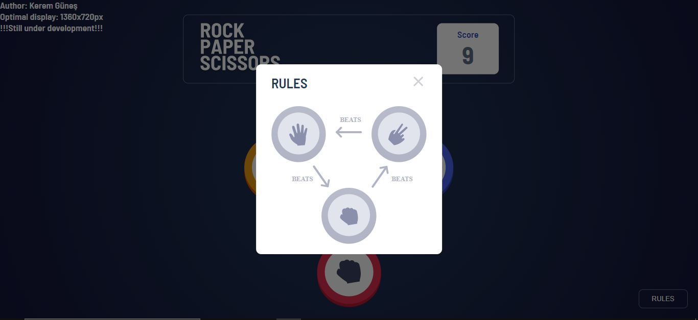
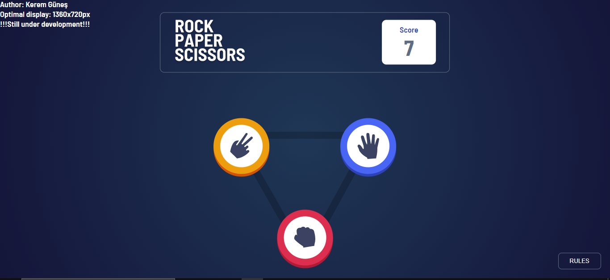
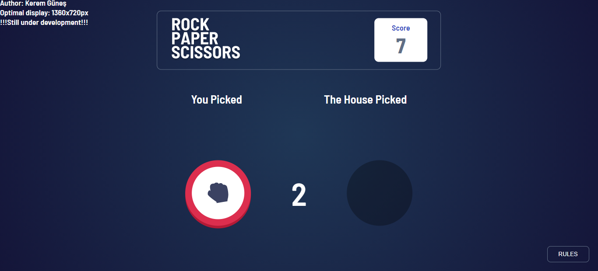
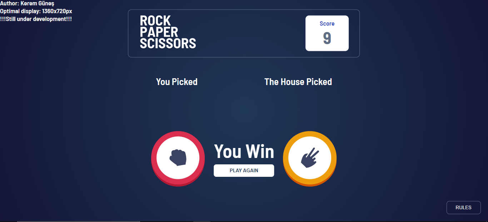

# Rock Paper Scissors Game

Hello to everyone,
Today I made the rock paper scissors game. The game works very well. But I will add a few extra features anyway. I share this version in case anyone wants to use it.

[Demo](https://rock-paper-scissors-game-javascript.vercel.app/)

## Notes

Author: Kerem Güneş  
Optimal display: 1360x720px  
!!!Still under development!!!   
Design will be made in accordance with different screen resolutions.  

## Screenshots

 
 

 
 

 
 

## TO DO LİST

- [ ] Design suitable for different screen resolutions
- [ ] Level system
- [ ] Reward system

# Taş Kağıt Makas Oyunu

Herkese merhaba,
Bugun taş kağıt makas oyununu yaptım. Oyun çok güzel bir şekilde çalışıyor. Ama yinede birkaç ekstra özellik ekleyeceğim. Bu halini de kullanmak isteyen olur diye paylaşıyorum.

## Notlar

Yapımcı: Kerem Güneş  
En uygun ekran çözünürlüğü: 1360x720px  
!!!Hala Yapım Aşamasındadır!!!

## Eklenecekler

- [ ] Farklı ekran çözünürlüklerine uygun tasarım
- [ ] Level sistemi
- [ ] Reward sistemi
